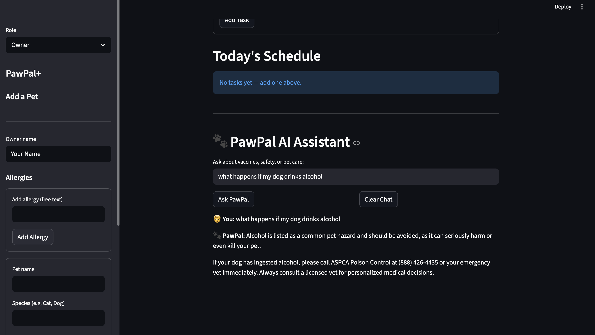
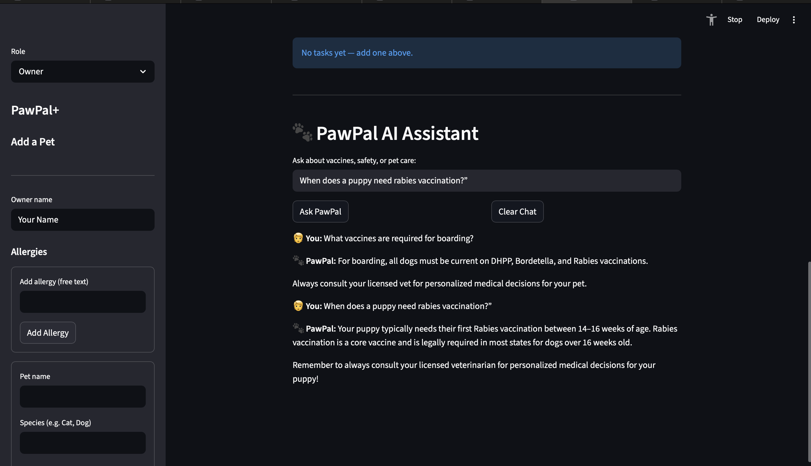
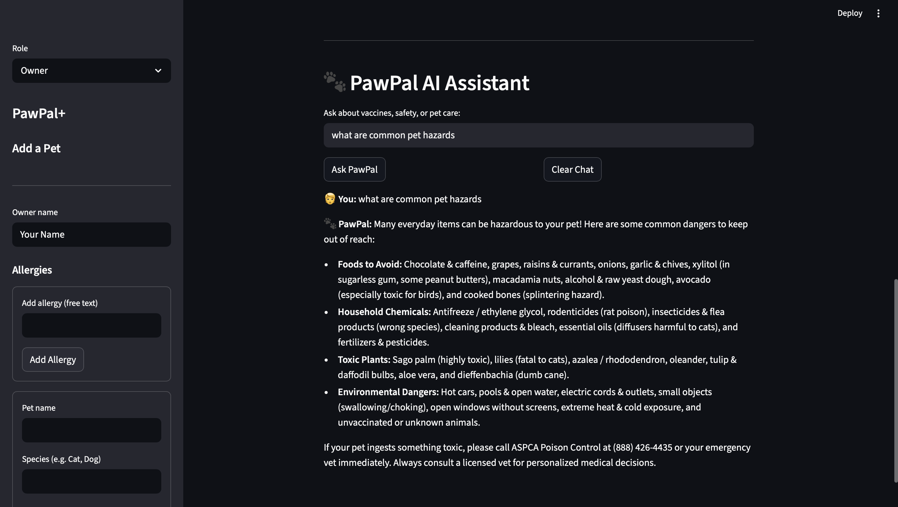
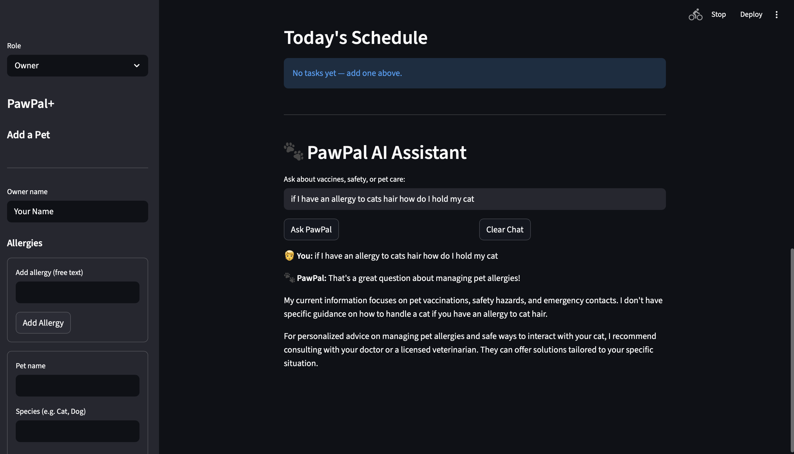
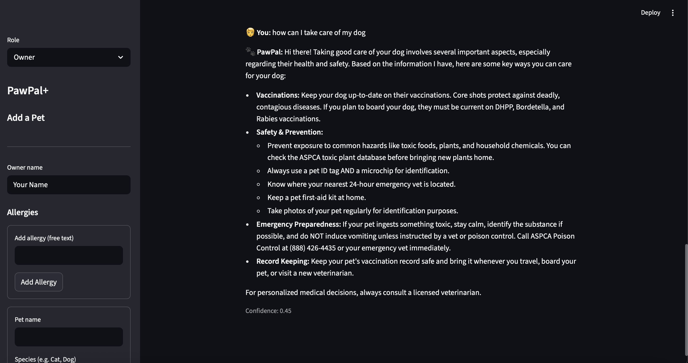

# PawPal+ (Module 2 Project)

You are building **PawPal+**, a Streamlit app that helps a pet owner plan care tasks for their pet.

## Scenario

A busy pet owner needs help staying consistent with pet care. They want an assistant that can:

- Track pet care tasks (walks, feeding, meds, enrichment, grooming, etc.)
- Consider constraints (time available, priority, owner preferences)
- Produce a daily plan and explain why it chose that plan

Your job is to design the system first (UML), then implement the logic in Python, then connect it to the Streamlit UI.

## What you will build

Your final app should:

- Let a user enter basic owner + pet info
- Let a user add/edit tasks (duration + priority at minimum)
- Generate a daily schedule/plan based on constraints and priorities
- Display the plan clearly (and ideally explain the reasoning)
- Include tests for the most important scheduling behaviors

## Getting started

### Setup

```bash
python -m venv .venv
source .venv/bin/activate  # Windows: .venv\Scripts\activate
pip install -r requirements.txt
```

### Suggested workflow

1. Read the scenario carefully and identify requirements and edge cases.
2. Draft a UML diagram (classes, attributes, methods, relationships).
3. Convert UML into Python class stubs (no logic yet).
4. Implement scheduling logic in small increments.
5. Add tests to verify key behaviors.
6. Connect your logic to the Streamlit UI in `app.py`.
7. Refine UML so it matches what you actually built.

## Demo

### Pet Owner

The owner can register pets, manage allergies, add tasks to their daily care plan, and track medications and upcoming appointments.

**Dashboard overview**


**Adding a pet**


**Adding a task to the daily plan**


**Viewing pet medications**


---

### Scheduler (Vet / Care Provider)

The care provider (vet) can claim patients, add medications, propose appointments, add tasks to an owner's plan, and send full recommended care plans to the owner's inbox.

**Claiming a patient**


**Adding a task to the owner's plan**


**Adding a medication**


**Adding a clinic for small pets (cats, dogs)**


**Creating a recommended plan**


**Plan received in owner's inbox**


### RAG DEMO outputs

**Drink Hazard**


**Vaccine Time**


**Vaccine Info**


**Common Pet Hazards**


**Allergy Not Spamming Answers**


**Confidence Score**



---

## Features

### Scheduling algorithms

- **Sorting by time** — tasks are always displayed in ascending `scheduled_time` order using a stable sort, so the daily plan reads chronologically regardless of the order tasks were added.
- **Duplicate-time conflict detection** — before rendering the schedule, the app scans for tasks that share the exact same time slot and surfaces a `st.warning` banner for each pair, flagging both tasks as conflicted.
- **Owner availability conflict detection** — each task's `check_conflict()` method compares its scheduled time against the owner's `WeeklySchedule` slots. Tasks outside the owner's available hours are blocked at entry and re-checked on every render.
- **Daily recurrence** — marking a daily task complete automatically generates a new task for the following day (`scheduled_time + 1 day`), keeping the plan self-replenishing without manual re-entry.
- **Weekly recurrence** — same mechanism as daily recurrence but advances by 7 days, supporting once-a-week care routines like grooming or vet check-ins.
- **Medication schedule generation** — `RecommendedPlan.build_medication_schedule()` maps a medication's frequency string (e.g. "twice daily", "every 8 hours") to a list of administration times, producing a full day's dose schedule automatically.
- **Allergy-aware guidelines** — `RecommendedPlan.build_allergy_guidelines()` cross-references the owner's declared allergies against a keyword map to produce per-task safety instructions (e.g. "wear a dust mask during bath time" for a dander allergy).
- **Provider appointment conflict guard** — `CareProvider.add_appointment()` cancels any proposed appointment that falls within 3 days of an existing owner-scheduled appointment, preventing double-booking.

### UI features

- Sorted schedule table (`st.table`) showing time, task, pet preference, and status at a glance.
- Per-task `st.success` / `st.warning` / `st.error` badges reflecting real-time conflict and completion state.
- Owner and Care Provider roles with separate consoles.
- Inline task add/remove/complete with live re-render.

## Testing PawPal+

### Run the test suite

```bash
python -m pytest tests/test_pawpal.py -v
```

### What the tests cover

| # | Test | What it verifies |
|---|------|-----------------|
| 1 | `test_mark_complete_changes_status` | `mark_complete()` flips `completed` from `False` to `True` |
| 2 | `test_adding_task_increases_count` | Adding a task via `PetOwner.add_task()` grows the plan's task list |
| 3 | `test_tasks_sorted_chronologically` | Tasks added out of order sort correctly by `scheduled_time` |
| 4 | `test_two_tasks_at_same_time_both_present` | No task is silently dropped when two share the exact same time |
| 5 | `test_daily_recurrence_creates_next_day_task` | A daily recurring task generates a successor exactly 24 h later |
| 6 | `test_weekly_recurrence_creates_next_week_task` | A weekly recurring task generates a successor exactly 7 days later |
| 7 | `test_no_recurrence_returns_none` | A task without a recurrence attribute returns `None` on completion |
| 8 | `test_conflict_flagged_when_owner_has_no_availability` | A task is flagged as conflicted when the owner has no availability slots |
| 9 | `test_no_conflict_when_task_falls_within_available_slot` | A task inside a valid availability slot is not flagged |
| 10 | `test_two_tasks_same_time_both_flagged_when_no_availability` | Both same-time tasks are each independently conflict-checked |

### Confidence Level

**★★★★☆ (4 / 5)**

The core scheduling behaviors — sorting, recurrence, and conflict detection — are fully covered and all 10 tests pass. One star is withheld because the `recurrence` attribute is not a declared dataclass field (it must be set manually via `setattr`), which is a fragile contract that future contributors could easily miss. Addressing that in the model would push confidence to 5/5.


### Testing Confidence scoring for RAG tool
- The assistant includes a simple confidence mechanism based on retrieval .Confidence is derived from similarity scores of retrieved chunks . 
- Higher similarity → higher confidence

- Strong match → confidence ≈ 0.8–0.95
- Weak/missing context → confidence ≈ 0.3–0.5
- This helps indicate when answers may be less reliable.

---

# 🧠 RAG Assistant (PawPal+ AI)

PawPal+ includes an AI assistant that helps answer pet care questions using trusted documents.

## Scenario

A pet owner may not always know:

* When a vaccine is required
* What foods or substances are dangerous
* When to contact a vet

Instead of guessing or searching externally, the app provides an assistant that:

* Answers questions based on verified documents
* Explains pet care decisions in simple language
* Supports (but does not replace) professional veterinary advice

---

## What this feature does

The RAG assistant:

* Accepts natural language questions from the user
* Searches relevant pet care documents (vaccination charts, safety guides)
* Returns answers grounded in those documents
* Avoids hallucinations by restricting responses to retrieved context

---

## How it works

### Document processing

* PDF documents are loaded using `PyPDFLoader`
* Content is split into smaller chunks using `RecursiveCharacterTextSplitter`
* Chunking improves retrieval accuracy

---

### Embeddings

* Each text chunk is converted into a vector using:

  * `HuggingFaceEmbeddings (all-MiniLM-L6-v2)`
* This allows semantic similarity search (not just keyword matching)

---

### Vector database (ChromaDB)

* All embeddings are stored in a persistent **Chroma database**
* Stored locally in `chroma_db/`
* Avoids recomputing embeddings on every run

---

### Retrieval

When a user asks a question:

* The question is embedded into a vector
* The system retrieves the top *k* most relevant document chunks
* Retrieval is based on semantic similarity

---

### Response generation

* Retrieved context is passed into a prompt
* The model (`gemini-2.5-flash`) generates the final answer
* The assistant is instructed to:

  * Only use provided context
  * Say when information is missing

---

## Integration with PawPal+

The assistant is available inside the Streamlit app as a chat interface.

It complements the scheduling system by:

* Explaining care decisions (e.g., vaccine timing)
* Providing safety guidance (e.g., toxic foods)
* Helping users understand recommended plans

---

## Design constraints

* The assistant does **not** use external knowledge
* All answers must come from retrieved documents
* If no relevant information is found, the assistant responds honestly

---

## Example usage

* “When does a puppy need rabies vaccination?”
* “Is chocolate toxic to dogs?”
* “What vaccines are required for boarding?”

---

## Future improvements

* Add document source citations (page references)
* Personalize answers based on pet age and species
* Generate suggested tasks from AI responses
* Combine keyword + vector search for improved retrieval

---


